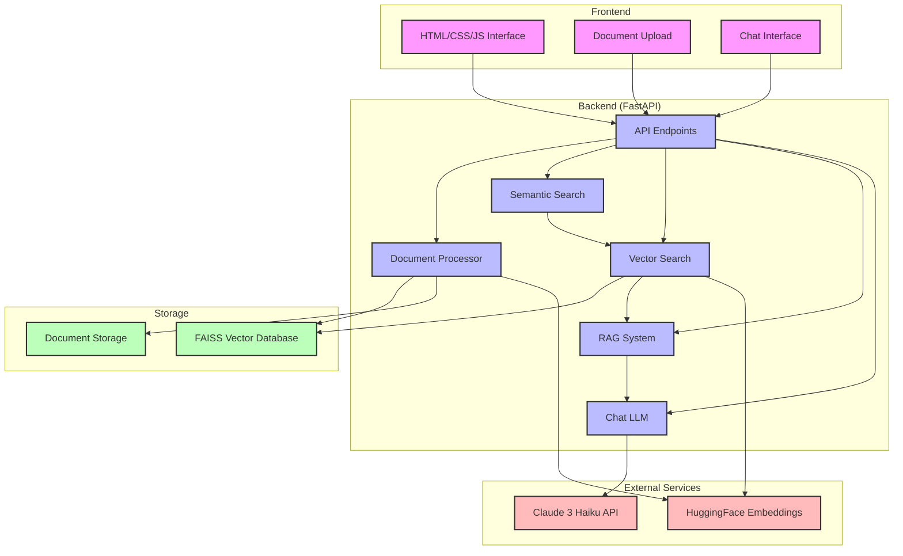
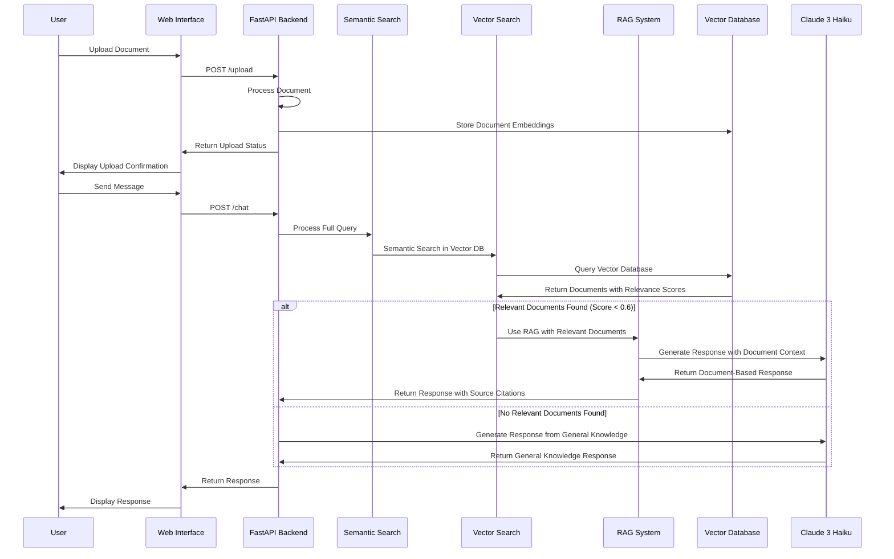
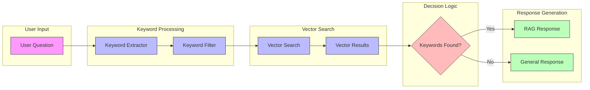

# Notif Chatbot Architecture

## System Architecture Diagram



## Data Flow Diagram



## Component Architecture

```mermaid
flowchart TD
    subgraph "User Interface"
        direction TB
        UI_Container[Chat Container]
        UI_Input[Message Input]
        UI_Upload[Document Upload]
        UI_Messages[Message Display]
        UI_Status[Status Indicators]
        
        UI_Container --> UI_Input
        UI_Container --> UI_Upload
        UI_Container --> UI_Messages
        UI_Container --> UI_Status
    end
    
    subgraph "API Layer"
        direction TB
        API_Chat[/chat Endpoint]
        API_Upload[/upload Endpoint]
        API_Vector[/vector-info Endpoint]
        API_VectorView[/vector-view Endpoint]
        
        API_Chat --> API_Upload
        API_Chat --> API_Vector
    end
    
    subgraph "Core Processing"
        direction TB
        CP_DocProc[Document Processor]
        CP_Embeddings[Embedding Generator]
        CP_Chunking[Text Chunker]
        CP_SemanticSearch[Semantic Search]
        CP_VectorSearch[Vector Search]
        
        CP_DocProc --> CP_Chunking
        CP_Chunking --> CP_Embeddings
        CP_SemanticSearch --> CP_VectorSearch
    end
    
    subgraph "RAG System"
        direction TB
        RAG_Retriever[Document Retriever]
        RAG_Context[Context Builder]
        RAG_Generator[Response Generator]
        
        RAG_Retriever --> RAG_Context
        RAG_Context --> RAG_Generator
    end
    
    subgraph "Storage"
        direction TB
        ST_FAISS[FAISS Vector Store]
        ST_Uploads[Document Storage]
        
        ST_FAISS --> ST_Uploads
    end
    
    subgraph "External APIs"
        direction TB
        EXT_Claude[Claude API]
        EXT_HF[HuggingFace API]
    end
    
    %% Cross-component connections
    UI_Input --> API_Chat
    UI_Upload --> API_Upload
    API_Upload --> CP_DocProc
    CP_DocProc --> ST_Uploads
    CP_Embeddings --> ST_FAISS
    API_Chat --> CP_SemanticSearch
    CP_VectorSearch --> ST_FAISS
    CP_VectorSearch --> RAG_Retriever
    RAG_Generator --> EXT_Claude
    CP_Embeddings --> EXT_HF
    
    %% Define styles
    classDef ui fill:#f9f,stroke:#333,stroke-width:1px;
    classDef api fill:#bbf,stroke:#333,stroke-width:1px;
    classDef core fill:#bfb,stroke:#333,stroke-width:1px;
    classDef rag fill:#fbf,stroke:#333,stroke-width:1px;
    classDef storage fill:#fbb,stroke:#333,stroke-width:1px;
    classDef external fill:#bff,stroke:#333,stroke-width:1px;
    
    class UI_Container,UI_Input,UI_Upload,UI_Messages,UI_Status ui;
    class API_Chat,API_Upload,API_Vector,API_VectorView api;
    class CP_DocProc,CP_Embeddings,CP_Chunking,CP_SemanticSearch,CP_VectorSearch core;
    class RAG_Retriever,RAG_Context,RAG_Generator rag;
    class ST_FAISS,ST_Uploads storage;
    class EXT_Claude,EXT_HF external;
```

## Keyword-Based RAG System


